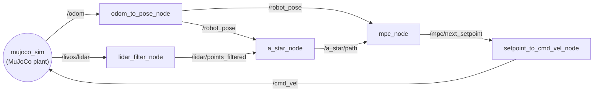

# Map-free navigation of the Unitree G1 — rolling-horizon A\* + nonlinear MPC

[](https://docs.ros.org/en/humble/) [](https://mujoco.org/) [](https://www.unitree.com/g1/) [](https://web.casadi.org/)

Autonomous navigation in an **unknown environment**, with no prior map, for the **Unitree G1**
humanoid. At every control cycle a LiDAR-based **Gaussian occupancy grid** is rebuilt around the
robot, a rolling-horizon **A\*** search produces a collision-free reference on it, and a
**nonlinear MPC** written in CasADi and solved by IPOPT turns that reference into body-frame
velocity commands.

The project is also the object of study: the deployed NLP is instrumented and measured — NLP
structure and sparsity, KKT conditions and multipliers, automatic
differentiation against finite differences, horizon and control-horizon sweeps, interior point against active set. Every number in the report comes from this stack, tested in simulation and most of the its components have been also deployed on real hardware.

---

## What runs



The plant is **MuJoCo** and it is the only simulator in this repository. Some considerations of the project also come from Gazebo and Isaac simulations.

The robot enters the chain in exactly two places: a parameter file and the name of the pose topic.
No node of the algorithmic stack is platform-specific.

---

## Requirements

| component | version in use |
|---|---|
| ROS 2 | **Humble** |
| MuJoCo | **3.9.0** (`pip install mujoco`; the G1 model uses `MjSpec`, needs ≥ 3.2) |
| Python | **3.10.12** (the ROS 2 Humble system interpreter) |
| CasADi | **3.7.2** |
| NumPy / SciPy / Matplotlib | 1.26.4 / 1.8.0 / 3.10.7 |

The `metrics/` tools do **not** need ROS, except the ones that read a rosbag (`rosbag2_py`).

---

## Build

```bash
cd ~/NOC_project
source /opt/ros/humble/setup.bash
colcon build --symlink-install
source install/setup.bash
```

`--symlink-install` matters: edits to Python files under `src/` then take effect without
rebuilding. A rebuild is only needed after touching `package.xml`, `setup.py`, or adding files.

Every terminal that launches something needs `source install/setup.bash` first.

---

## Running a simulation

Two shortcuts used throughout this section — they resolve the installed config folders, so the
commands work from any directory:

```bash
G1_CFG=$(ros2 pkg prefix g1_sim)/share/g1_sim/config
PLANNER_CFG=$(ros2 pkg prefix a_star_mpc_planner)/share/a_star_mpc_planner/config
```

### 1. Industrial warehouse, goal chosen by hand in RViz

```bash
ros2 launch g1_sim g1_a_star_mpc.launch.py
```

The MuJoCo viewer and RViz open, the robot spawns at (−12, 0) and **stands still**: no goal is
sent automatically. Pick one with the **2D Goal Pose** tool in the RViz toolbar — click on the
map, drag to set the heading, release. The tool publishes on `/goal_pose`, a relay forwards it to
`/global_goal`, which is what the planner listens to. The goal can be re-sent at any time, and the
stack replans from wherever the robot is.

At startup `mujoco_sim` prints a suggested goal for the current world, e.g.
`goal suggerito (10.0, 0.0) da assegnare con 2D Goal Pose` — that is the point the automatic
missions below use, so a run made by hand can be compared with a scripted one.

### 2. Industrial warehouse, goal assigned automatically

```bash
ros2 launch g1_sim g1_a_star_mpc.launch.py \
  use_mission:=true \
  mission_file:=$G1_CFG/mission_industrial.yaml
```

The waypoint runner publishes the goal **once, 20 s after launch** (`mission_delay:=<sec>` changes
the wait) and then monitors arrival. The delay is deliberate: `/global_goal` is published a single
time, so it leaves room to start the rosbag recorder before the run begins. Each
`mission_<world>.yaml` holds the same goal listed for that world in `WORLDS`, so runs are
repeatable and comparable across profiles.

### 3. Non-convex obstacle worlds

These are the worlds behind the escape experiments in the report. They come in two families, and
both must be run: a rule that refuses *every* concavity would clear all the traps and fail all the
controls.

| world | family | geometry |
|---|---|---|
| `dead_end` | trap | 2.0 × 12 m corridor closed at the far end, goal just beyond it |
| `horseshoe` | trap | 12 m deep U opening towards the robot, goal past its back |
| `l_corridor` | trap | 3 m wide L, two nested closures, goal towards the foot |
| `long_wall` | trap | 21 m wall, ends out of LiDAR range, single gap to the **north** |
| `long_wall_south` | trap | gap to the **south** while the goal sits north: forces an exploration first |
| `long_wall_false_north` | trap | 18 m wall; the north gap looks sealed but hides a 0.9 m passage |
| `open_corridor` | control (false positive) | same as `dead_end`, but **open** at the far end |
| `zigzag` | control (false positive) | wide corridor with 3 staggered baffles — it is passable |
| `door_room` | control (false positive) | wall with a single 1.6 m door: a concavity that must be entered |
| `industrial` | control (false positive) | the warehouse: convex, scattered obstacles |

Every world runs from the same command, with `world:=` and the matching mission file. Concave
geometry also needs the wider planning window, which is what `overlay_nonconvex.yaml` provides
(`grid_half_width` 6 → 10 m, `map_decay_sec` → 0):

```bash
W=horseshoe                                  # any name from the table above
ros2 launch g1_sim g1_a_star_mpc.launch.py world:=$W \
  use_mission:=true \
  mission_file:=$G1_CFG/mission_$W.yaml \
  planner_overlay:=$PLANNER_CFG/overlay_nonconvex.yaml
```

Drop `use_mission:=true mission_file:=...` to send the goal from RViz instead, exactly as in §1.
Keep the overlay on the control worlds too: traps and controls are only comparable when they are
solved with the same parameters.

Why the wider window is needed, and the measured `grid_half_width` at which each world stops
blocking the robot, is documented at the top of
[`overlay_nonconvex.yaml`](src/a_star_mpc_planner/config/overlay_nonconvex.yaml). The short
version: A\* plans on a window centred on the robot, a goal outside it is projected onto its
border, and on a concave obstacle that projection points straight into the trap.

### Launch arguments

| argument | default | effect |
|---|---|---|
| `world:=<name>` | `industrial` | world geometry, and with it the spawn pose |
| `use_mission:=true` | `false` | publish the goal automatically from `mission_file` |
| `mission_file:=<path>` | — | waypoint YAML, `$G1_CFG/mission_<world>.yaml` |
| `mission_delay:=<sec>` | `20.0` | wait before the mission publishes the first goal |
| `planner_overlay:=<path>` | `overlay_none.yaml` | parameters merged on top of the planner profile |
| `params_file:=<path>` | `planner_params_g1.yaml` | a different planner profile altogether |
| `people:=default` | `''` | dynamic obstacles (moving people) |
| `nav_graph:=true` | `false` | topological global memory (Dijkstra) |
| `use_rviz:=false` | `true` | run without RViz |
| `viewer:=false` | `true` | run without the MuJoCo window (faster, for batch runs) |
| `robot_model:=false` | `true` | skip the URDF: navigation is unaffected, RViz just shows no robot |

Worlds are defined in `WORLDS` of
[`g1_sim/mujoco_world.py`](src/g1_sim/g1_sim/mujoco_world.py); the mission files are regenerated
from it by `src/g1_sim/scripts/gen_missions.py`.

To stop everything — MuJoCo, RViz and every node — either Ctrl-C the launch or run
[`./kill_ros_nodes.sh`](kill_ros_nodes.sh) from another terminal.

---

## Record a run and extract the metrics

```bash
./metrics/record_run.sh <name>                      # BEFORE the goal is sent (/global_goal fires once)
python3 metrics/bag_source.py metrics/bags/<name>   # sanity check: solver success must be ~99–100 %
python3 metrics/make_results.py --bag metrics/bags/<name>
```

`make_results.py` writes `metrics/out/results.json`, `results.md` and the whole `metrics/out/tex/`
tree — one LaTeX macro per scalar. The rule that holds this together: **no number in the report is
ever typed by hand.** One writes `$\resPredDivergence$` and the value follows the code.

Measurements are grouped by class, because the class decides when they must be redone:

- **class 1 — properties of the formulation**, profile-only: truncation order, NLP structure and
  sparsity, AD against finite differences, exact ℓ¹ penalty;
- **class 2 — properties of the instance**, needs a bag: KKT/LICQ/complementarity on the actual
  IPOPT multipliers, bifurcation threshold;
- **class 3 — closed-loop performance**, needs a bag: prediction error along the horizon and the
  constraint back-off β(k) measured from it.

Each script under `metrics/` also runs on its own and documents in its docstring what it computes;
[`metrics/README.md`](metrics/README.md) is the index.

---

## Bayesian optimization of the MPC weights

The MPC cost weights were tuned offline by Bayesian optimization: a Gaussian-process surrogate is
fitted to a closed-loop cost evaluated on recorded runs, and the acquisition function proposes the
next set of weights to try. `tuning/` holds the optimizer, the trial plotting and the metric
extraction, `bag_gp_tuning/` the GP history, the marginals and the per-run metrics the report
tables are built from.

This is the one experiment that was **not** re-run on the G1. It was carried out earlier on the
**Unitree Go2**, and the report presents its results on that platform while every other measurement
comes from the G1 stack in this repository. The scripts kept here read the data that came out of
that campaign, so the figures and tables can be regenerated:

```bash
python3 tuning/plot_gp_fitted_function.py     # GP posterior over the cost
python3 tuning/regroup_trial_metrics.py       # per-trial metrics -> comparison tables
python3 tuning/make_metrics_tables_pdf.py     # the same tables as a PDF
```

The complete navigation stack those runs were made with — Go2 plant, missions, and the tuning loop
driving them end to end — lives in a separate repository, and that is where the campaign can be
reproduced in full:

**<https://github.com/talos-robotics-ai/Go2_navigation/tree/main>**

Paths are relative to this repository; the raw trial folders are not versioned here, so the
scripts that read them take the directory as an argument (or from `TUNING_RESULTS_DIR`). These
tools need `hyperopt`, `scikit-learn` and `pandas` on top of the packages listed above —
`tuning/requirement.txt` has the versions.

---

## Diagnostics

```bash
ros2 topic echo /mpc/diagnostics
# data: [success(0/1), cost, solve_time_ms, avg_solve_ms, total_failures]
```

| Topic | Type | Meaning |
|---|---|---|
| `/a_star/occupancy_grid` | `OccupancyGrid` | Gaussian obstacle map |
| `/a_star/path` | `Path` | A\* waypoint path |
| `/mpc/predicted_path` | `Path` | MPC prediction over the horizon |
| `/mpc/next_setpoint` | `PoseStamped` | current lookahead setpoint |
| `/global_goal` | `PoseStamped` | the goal the stack is driving to |

All of them are already in the RViz configuration that the launch opens.

---

## Repository structure

```
NOC_project/
├── src/
│   ├── a_star_mpc_planner/     # A* on a Gaussian grid + nonlinear MPC (CasADi/IPOPT)
│   ├── g1_sim/                 # MuJoCo plant, G1 assets, worlds, missions, RViz, launch
│   ├── robot_real_lidar/       # point cloud: sensor frame → planning frame (range/height/voxel)
│   ├── robot_real_goal_manager/# RViz /goal_pose relay + waypoint mission runner
│   └── PointCloud-GNNencoder/  # exploratory: learned scene embedding, not in the control loop
├── metrics/                    # offline measurement of the optimization problem → figures + LaTeX
├── snippets/                   # standalone: NLP structure and sparsity vs the horizon
├── tests/                      # integrator truncation order
└── tuning/, bag_gp_tuning/     # Bayesian optimization of the MPC weights (Go2 campaign)
```

| Package | Description |
|---|---|
| [`a_star_mpc_planner/`](src/a_star_mpc_planner/) | Rolling-horizon A\* on a Gaussian occupancy grid + nonlinear MPC tracker (CasADi/IPOPT), geodesic local-target metric and tabu memory for non-convex obstacles, optional topological navigation graph |
| [`g1_sim/`](src/g1_sim/) | MuJoCo plant of the G1 (29 DoF, simulated Mid-360 LiDAR), world geometries, missions, RViz config, and the top-level launch |
| [`robot_real_lidar/`](src/robot_real_lidar/) | Point-cloud adapter: range + height filter, voxel downsample, TF into the planning frame. Fully parametric — the robot enters through the YAML only |
| [`robot_real_goal_manager/`](src/robot_real_goal_manager/) | RViz `/goal_pose` → `/global_goal` relay + YAML-driven waypoint mission runner for repeatable trials |
| [`metrics/`](metrics/) | Offline measurement of the optimization problem: panels, sweeps, KKT analysis, and the LaTeX generator |

---

## Acknowledgements

- [CasADi](https://web.casadi.org/) — symbolic framework for nonlinear optimization
- [IPOPT](https://coin-or.github.io/Ipopt/) — interior-point NLP solver
- [MuJoCo](https://mujoco.org/) — the simulation plant
- [WildOS](https://github.com/nasa-jpl/nebula2-wildos) — inspiration for the topological navigation graph
